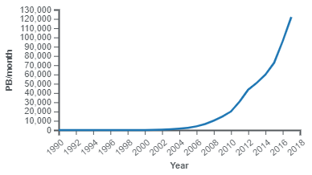
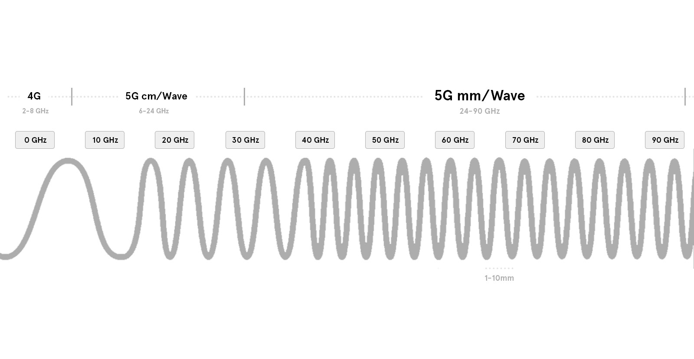
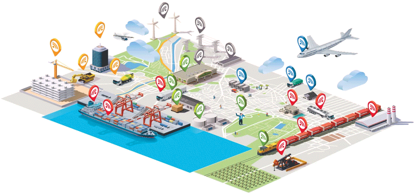

# On the Horizon 
> ***“Our intuition about the future is linear. But the reality of information technology is exponential, and that makes a profound difference. If I take 30 steps linearly, I get to 30. If I take 30 steps exponentially, I get to a billion.”*** - Ray Kurzweil
## Growing Data Consumption 
* In 2016 Internet traffic passed one zettabyte (1,000,000,000,000,000,000,000 bytes) in annual use. In 2021 that traffic is expected to be tripled.  
* ISPs have been pushing to expand their infastructure to accomidate a growing Internet demands. 
--- 

---
## 5G Network 
* A 5G network can handle 1000 times the traffic at 10 times the current speed of 4G networks. 
* This is significant not only becasue it will make data transfers over the Internet faster and more reliable now but it will free up bandwidth for what will come next. 
* 5G operates at 28 GHz to 39 GHz which is about 10 times the frequency and speed of 4G. Higher frequncies means that the signal wave lengths themselves are shorter, so more information can be communicated in a shorter bandwidth. 
---

---
## The Internet of Things 
---
* Already we have wide and diverse ecosystem of Networked devices. Everything from smart light bulbs to driverless cars need to transfer their packets on the Internet. As technologies are refined and advance we will continue to see more and more devices that require the Internet to operate. 
* Nearlly all digital entertainment is already dependent the Internet. In the near future likely many other static objects in our lives will be networked. 

* Your clothing may have senors in it that can give you a live read out of your vitals, buildings will be able to monitor and track their maintence and reconstruction requirments based on data it can recieve from networked building materials, city's will becoming "smart" with all infastructure able to communicate to request service and give updates on ware. 
* More and more of our world will have an Internet pressence and requirements. As our world becomes more integrated technologies that haven't even been dreamt of will emerge to cater to even more increasing demand for information transfer and storage.  

